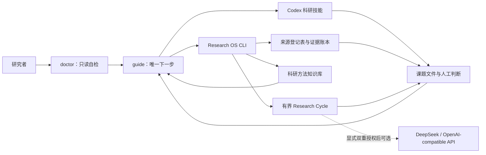
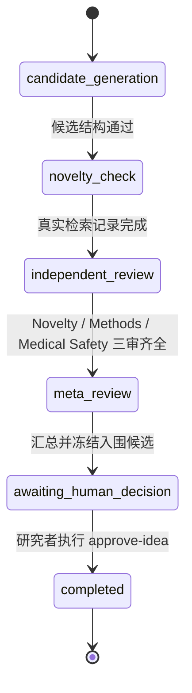

# Research OS 开发交接与功能说明

> 最后核对：2026-08-12；包版本：`0.4.0`；功能基线以本文档所在提交为准。
>
> 本文把“已经实现”和“规划中”分开记录。除非明确标注为规划，否则下文功能均可在当前仓库中找到代码与测试。

## 1. 项目定位

Research OS 是一个面向大模型方向研究生的本地、证据优先科研工作区。它把模糊研究方向逐步整理成可复核的文献证据、候选 Idea、实验设计、结果解释、论文草稿和模拟审稿材料。

当前系统的核心边界：

- 提供科研指导、资料整理和流程减负；
- 不在本仓库执行训练、微调、量化、强化学习或集群实验；
- 不把模型输出当成事实，事实必须回到已登记来源和原文定位；
- 不允许模型自行批准最终 Idea，关键决策保留给研究者；
- 不处理真实可识别病例、原始病历或个体诊疗请求；
- 外部大模型是可选能力，默认完全本地运行。

适用方向包括医疗 AI 诊断与推理、医学大模型、思维链可靠性、文本处理，以及微调、量化和 RL 相关的方法调研与实验规划。

## 2. 当前完成度

当前稳定版本是 `v0.4.0`，已经完成：

1. 科研课题工作区和标准模板；
2. 文献来源登记、去重、课题关联和批量原子导入；
3. PDF 文本提取与页码边界保留；
4. 证据账本及严格来源校验；
5. 每日科研导航 `guide`；
6. 11 个 Codex 科研技能；
7. 有预算、可恢复、可审计的 AI Co-Researcher Idea 循环；
8. Novelty、Methods、Medical Safety 三路独立评审和 meta-review；
9. 研究者人工批准门禁；
10. OpenAI-compatible API 接入，包括自定义 DeepSeek 配置；
11. 调用授权、来源授权、敏感医疗字段拦截和 provenance；
12. 哈希链研究日志、产物哈希、并发保护和失败回滚；
13. 源码安装、wheel 安装和关键用户旅程测试；
14. 结构化科研方法知识库、确定性搜索和课题推荐；
15. 28 条专业种子来源、17 张知识卡、5 张主题地图和 4 份方法手册；
16. 医疗 AI 报告规范路由和知识库完整性检查。

截至本文档更新，v0.4 完整测试为 `228 passed`，并使用 warnings-as-errors；发布交付仍应重跑本文第 13 节的全部命令。

## 3. 系统总览



系统不是一个无限自主代理。正常使用方式是：先运行 `doctor`，再让 `guide` 检查真实产物并只给出一个下一步；Codex 技能或 CLI 完成该步骤后，再次运行 `guide`。

## 4. 仓库结构

```text
.
├─ .agents/skills/             # 11 个 Codex 科研技能
├─ config/
│  ├─ research.yaml            # 工作区基础配置
│  └─ providers.example.yaml   # 外部模型角色示例
├─ docs/
│  └─ superpowers/
│     ├─ specs/                # 已批准或待批准的设计规格
│     └─ plans/                # 对应实施计划
├─ inbox/                      # 用户待登记材料
├─ library/
│  ├─ sources.jsonl            # 全局来源登记表
│  ├─ sources/                 # 提取文本等来源副本
│  ├─ papers/                  # 结构化论文卡片
│  ├─ knowledge/               # 目录、知识卡、地图、手册与报告规范
│  └─ literature-matrix.csv    # 课题文献比较矩阵
├─ projects/<slug>/            # 各课题严格隔离的工作区
├─ src/research_os/            # Python 包和 CLI
└─ tests/                      # 单元、回归与 wheel 冒烟测试
```

`library` 是全局资料库，但一个课题只能使用自己 `project.yaml` 中显式关联的 `source_id`。全局存在某篇论文不代表所有课题都可以自动引用它。

## 5. 一个课题包含什么

`new-project` 创建的核心结构如下：

| 文件或目录 | 作用 |
|---|---|
| `START-HERE.md` | 新课题的最短使用入口 |
| `project.yaml` | 课题标题、slug、创建时间和显式关联的 `source_ids` |
| `00-research-brief.md` | 研究问题、范围、假设、约束和失败判据 |
| `01-search-log.md` | 数据库、检索式、日期、纳排标准和下一轮检索 |
| `02-evidence-ledger.yaml` | 可核验事实、推断、假设、支持、反证和限制 |
| `03-literature-review.md` | 共识、冲突、方法差异和研究空白 |
| `04-idea-candidates.md` | 人类可读的候选 Idea 与反向审查 |
| `05-experiment-design.md` | 基线、数据划分、消融、统计、预算和失败判据 |
| `06-result-analysis.md` | 外部实验结果的保守解释 |
| `ideas/archive.yaml` | 机器可校验的 Idea 状态、来源和人工选择 |
| `cycles/<run_id>/` | 每次有界科研循环的状态与产物 |
| `research-journal.jsonl` | 追加式、哈希链研究事件日志 |
| `artifacts/` | 外部实验仓库导出的脱敏聚合结果 |
| `writing/` | 稿件、大纲和图表说明 |
| `reviews/` | 模拟审稿和返修材料 |

文件存在不等于阶段完成。`guide` 会检查完成标记、结构、来源、哈希和先决条件；随手修改一个字符只会被视为“进行中”。

## 6. CLI 功能

安装后入口是 `research-os.exe`，也可使用 `python -m research_os`。

| 命令 | 作用 | 是否写文件 | 是否联网 |
|---|---|---:|---:|
| `doctor` | 检查 Python、目录、技能、来源、课题、循环和日志 | 否 | 否 |
| `guide` | 显示当前阶段、阻塞原因和唯一下一步 | 否 | 否 |
| `new-project` | 创建标准课题目录和模板 | 是 | 否 |
| `add-source` | 登记、去重并可选关联单条来源 | 是 | 否 |
| `add-sources` | 从 UTF-8 清单原子批量登记来源 | 是 | 否 |
| `extract-pdf` | 提取带 `<!-- page:N -->` 边界的 PDF 文本 | 是 | 否 |
| `validate-ledger` | 校验证据类型、状态、定位和来源范围 | 否 | 否 |
| `cycle` | 创建或恢复有界科研循环 | 是 | 默认否；显式授权后可调用 API |
| `approve-idea` | 由研究者批准当前 run 的入围 Idea | 是 | 否 |
| `model-call` | 发起一次受控 OpenAI-compatible API 调用 | 是 | 是，必须显式授权 |
| `kb doctor` | 检查目录、卡片、来源、定位、替代关系和资产引用 | 否 | 否 |
| `kb search` | 按固定权重执行本地可解释检索 | 否 | 否 |
| `kb recommend` | 根据课题画像和 guide 阶段返回最多三项参考 | 否 | 否 |

日常入口：

```powershell
.\.venv\Scripts\research-os.exe doctor
.\.venv\Scripts\research-os.exe guide --project medical-reasoning
```

批量登记来源：

```powershell
.\.venv\Scripts\research-os.exe add-sources `
  ".\inbox\sources.txt" `
  --project medical-reasoning
```

清单一行失败时整批失败，来源登记表和课题关联均会回滚。不要把失败清单降级成逐行导入，否则会破坏全有或全无语义。

启动或恢复科研循环：

```powershell
.\.venv\Scripts\research-os.exe cycle `
  --project medical-reasoning `
  --max-ideas 4 `
  --max-calls 6
```

默认 `cycle` 不调用外部模型。只有同时提供 `--provider-role` 和 `--allow-external-api`，且所有进入上下文的来源均已授权、哈希未漂移，才允许外发。

知识库日常入口：

```powershell
.\.venv\Scripts\research-os.exe kb doctor
.\.venv\Scripts\research-os.exe kb search "diagnostic accuracy" --topic medical-ai
.\.venv\Scripts\research-os.exe kb recommend --project medical-reasoning
```

全局知识条目只提供方法学线索。推荐命令不会改写 `project.yaml`；需要引用时仍必须用 `paper-intake` 显式关联到目标课题。

## 7. 11 个 Codex 科研技能

| 技能 | 使用阶段 | 核心输出 |
|---|---|---|
| `research-project-init` | 新方向或开题 | 可证伪研究简报 |
| `paper-intake` | 接收论文或清单 | 去重来源和课题关联 |
| `paper-deep-read` | PDF 精读 | 带 `source_id` 和原文定位的论文卡片 |
| `literature-synthesis` | 多论文综合 | 共识、冲突、差异、空白和下一轮检索 |
| `research-cycle` | 有界 Idea 循环 | 候选、新颖性记录、三审和 meta-review |
| `idea-review` | 单个 Idea 深审 | 新颖性、可行性和最强反对意见 |
| `experiment-advisor` | 实验规划 | 基线、消融、指标、统计和失败判据 |
| `result-interpreter` | 外部实验完成后 | 支持与不支持的结论、异常和负结果 |
| `manuscript-assistant` | 写作 | 基于证据账本的稿件和引用缺口 |
| `mock-reviewer` | 投稿前 | 方法、统计、复现和医疗安全审查 |
| `research-weekly-review` | 每周复盘 | 证据变化、阻塞与下周三个行动 |

技能位于 `.agents/skills/<skill>/SKILL.md`。修改技能时必须保持“事实—模型推断—研究者判断”分离，并同步更新 `tests/test_skills.py`。

## 8. 证据模型

### 8.1 来源登记表

`library/sources.jsonl` 的每条记录包含：

- 稳定的 `source_id`；
- 来源类型与规范化标识；
- 本地文件内容哈希；
- 导入时间和人工笔记；
- 是否允许发送到外部 API。

本地文件移动后重新登记同一内容会复用 ID 并刷新当前路径。内容变化会被视为哈希漂移，在重新登记前不能作为已核验证据或外发来源。

### 8.2 证据账本

`02-evidence-ledger.yaml` 把 claim 分为：

- `fact`：可由已登记来源直接核验；
- `inference`：模型或研究者从事实推导出的解释；
- `hypothesis`：待实验验证的研究假设。

已核验事实必须带当前课题已关联的 `source_id` 和页码、章节、表格或可复核段落定位。账本还保存反证、置信度和局限，避免只收集支持性证据。

## 9. AI Co-Researcher 状态机



每个 `run` 保存：

- `manifest.yaml`：状态、预算、调用次数、产物哈希和最后错误；
- `work-packet.md`：给 Codex 技能的阶段工作包；
- `context.md` 或带哈希后缀的上下文快照；
- `candidates.yaml`：结构化 Idea；
- 三份独立评审 JSON；
- `meta-review.json`；
- provider 输出和 `.provenance.json`；
- 对应的哈希链 journal 事件。

重要约束：

- Provider 可以生成候选、评审和汇总，但不能伪造真实 novelty 检索；
- 三份评审必须对应当前 `run_id` 和同一组 Idea；
- 模型只能给出排序建议，不能写入最终 `selected`；
- `approve-idea` 必须由研究者提供批准理由，并原子完成 run；
- 重跑 `cycle` 会从已校验产物恢复，只有 `--new-run` 才新建循环；
- 不保存隐藏思维链，只保存简洁理由、证据位置、冲突、哈希和 provenance。

## 10. 外部模型与 DeepSeek

复制示例配置，不要提交真实配置或 Key：

```powershell
Copy-Item .\config\providers.example.yaml .\config\providers.yaml
$env:DEEPSEEK_API_KEY="你的真实 Key"
```

`config/providers.yaml` 中的角色是路由别名，可为每个角色指定 OpenAI Chat Completions 兼容的 `base_url`、`model`、`api_key_env`、温度和超时。模型名称会随服务商变化，使用前应以服务商当前官方文档为准。

外发采用双重授权：

1. 命令必须带 `--allow-external-api`；
2. 每个参与上下文的底层来源在登记时也必须允许外发。

此外还会校验本地文件哈希、课题关联、账本 claim 的来源范围和潜在可识别医疗字段。API Key 只从环境变量读取，不写入配置、日志或 provenance。Provider 响应上限为 1 MiB。

## 11. 可靠性与安全不变量

后续开发不得绕过以下约束：

1. **课题证据隔离**：B 课题不能引用只关联 A 课题的来源。
2. **真实来源门禁**：未知、漂移或未授权的来源不能进入已核验事实或外发上下文。
3. **人工产物优先**：网络等待期间用户新建的文件不得被 provider 覆盖。
4. **路径安全**：`projects`、`library` 和 run 目录不得通过符号链接、Windows junction 或中途目录替换写到工作区外。
5. **原子变更**：来源登记、课题关联、manifest、Idea 档案和 journal 的跨文件变更失败时必须回滚。
6. **有界调用**：调用前占用预算；网络错误和坏响应同样消耗一次，防止无限重试。
7. **并发安全**：provider 调用预算使用跨平台 advisory lock，陈旧 lock 不能永久阻塞后续运行。
8. **Create-only 提交**：provider 产物只填补缺失阶段文件，提交前再次校验目录身份与目标不存在。
9. **可审计恢复**：manifest 状态、产物哈希、当前 run、三审、selected Idea 和 journal 必须相互一致。
10. **医疗安全**：不接收可识别医疗数据，当前关键词拦截只是最低防线，不等同于完整 DLP。
11. **无隐藏 CoT**：持久化简洁判断依据，不要求或保存模型内部思维链。
12. **逐事实可定位**：每条“已报告事实”必须独立带当前 `source_id` 和与阅读范围一致、已在卡片声明的 locator；摘要卡只能使用 `abstract`。
13. **规范版本路由**：doctor 必须严格解析报告规范适用矩阵；旧规范由 `superseded_by` 路由到已核验的 active 版本。

## 12. 代码模块索引

| 模块 | 职责 | 后续开发注意点 |
|---|---|---|
| `cli.py` | 参数解析、退出码和事务编排 | 保持错误码和批量原子语义 |
| `project.py` | 工作区/课题创建、manifest、路径约束 | Windows reparse point 与目录身份是高风险区 |
| `sources.py` | 来源规范化、去重、哈希、授权 | 不能静默覆盖人工 notes |
| `pdf.py` | PDF 文本提取和页码边界 | 无文本层时应停止并提示 OCR |
| `evidence.py` | 证据账本加载和严格校验 | 不要自动修补或猜测 source_id |
| `guidance.py` | 阶段判断和唯一下一步 | 文件已编辑不等于质量门禁已过 |
| `ideas.py` | Idea schema、状态迁移、人工选择 | `selected` 只能来自人工批准路径 |
| `review.py` | 三路评审和 meta-review schema | 必须绑定当前 run 和 Idea 集合 |
| `cycle_context.py` | 构建可外发的最小上下文 | 所有 claim 逐条校验授权和归属 |
| `cycle.py` | run 状态机、provider 阶段、预算与恢复 | 当前约 1773 行，是未来拆分候选，但拆分前先补回归测试 |
| `provider_config.py` | Provider 角色配置校验 | 配置不保存 Key |
| `provider.py` | OpenAI-compatible 调用和 provenance | 维持 HTTPS、大小限制和显式授权 |
| `journal.py` | 追加式哈希链研究日志 | journal 损坏必须阻断状态推进 |
| `doctor.py` | 只读工作区完整性检查 | 任何数据损坏都应转为可读 FAIL，而不是异常崩溃 |
| `io.py` | 原子写入和 create-only 基元 | 不要退化为普通覆盖写 |
| `knowledge.py` | catalog/card/profile schema、来源和路径校验、KB doctor | 阅读范围和 locator 门禁不能放宽 |
| `knowledge_search.py` | 固定权重检索和稳定排序 | 禁止引入随机、联网或不可解释排序 |
| `knowledge_recommend.py` | 课题画像、阶段、手册和报告规范推荐 | 最多三项，绝不自动关联项目证据 |

## 13. 开发与验证

首次安装：

```powershell
python -m venv .venv
.\.venv\Scripts\python.exe -m pip install -e ".[dev]"
```

每次修改后至少运行：

```powershell
$env:PYTHONUTF8="1"
.\.venv\Scripts\python.exe -m compileall -q src
.\.venv\Scripts\python.exe -m pytest -q -W error
.\.venv\Scripts\python.exe -m pip check
git diff --check
```

发布或修改打包配置时，还应从临时目录安装 wheel，并运行 `tests/installed_wheel_smoke.py` 覆盖源码目录之外的真实安装路径。构建示例：

```powershell
.\.venv\Scripts\python.exe -m pip wheel . --no-deps --no-build-isolation --wheel-dir dist
```

测试目录按领域拆分：CLI、课题、来源、证据、PDF、指导、Idea、评审、循环、上下文、provider、doctor、技能与工作区。修复缺陷时先添加能稳定复现问题的测试，再改实现。

## 14. 设计和提交脉络

主要设计文档：

- `docs/superpowers/specs/2026-08-12-research-os-design.md`：初始 Research OS；
- `docs/superpowers/specs/2026-08-12-research-os-daily-driver-design.md`：每日驾驶舱；
- `docs/superpowers/specs/2026-08-12-research-os-co-researcher-design.md`：有界 AI Co-Researcher；
- `docs/superpowers/specs/2026-08-12-research-methods-knowledge-base-design.md`：v0.4 专业知识库设计；
- `docs/superpowers/plans/2026-08-12-research-methods-knowledge-base.md`：v0.4 TDD 实施计划。

关键提交脉络：

| 提交 | 内容 |
|---|---|
| `2f197d8` | 防篡改研究日志 |
| `cd0aaa6` | 证据绑定 Idea 档案 |
| `130e749` | 三路独立评审校验 |
| `2a26815` | 有界科研循环编排 |
| `e692934` | 显式授权的外部 provider |
| `ed71b62` | 暴露 cycle CLI |
| `2683e96` | `guide` 接入科研循环 |
| `23e0a8c` | 并发、回滚、上下文和人工文件保护加固 |
| `d21554b` | provider 预算锁崩溃恢复 |
| `8bd3cde` / `3ac6907` | v0.4 专业知识库设计及整理 |
| `bfcc833` | 知识目录、卡片和画像严格校验 |
| `71c2c9a` | 确定性知识检索 |
| `3bb4e9c` | 课题方法推荐 |
| `4b5c6f8` | `kb` CLI |
| `f7aa067` | `guide` 和 `doctor` 集成 |
| `bc0b34b` | v0.4 专业种子知识库 |

## 15. 已知限制与技术债

- 本仓库不执行实验，只把流程推进到严谨实验设计并接收外部聚合结果；
- 当前没有向量数据库、embedding 检索或知识图谱服务；
- 当前没有自动在线刷新论文和指南，来源仍需登记和核验；
- 当前知识库有 28 条种子来源和 17 张卡；仍需逐步把摘要卡升级为全文卡，并定期核对规范更正与版本；
- 医疗敏感字段拦截是保守关键词检查，不可替代机构数据治理和伦理审批；
- `cycle.py` 体积较大，未来可按状态阶段、事务和 provider 提交拆分，但必须保持现有恢复/并发测试；
- 自动评审是研究质量辅助信号，不能替代导师、同行评审、统计复核或临床验证；
- 软件尚未承诺稳定公共 Python API，现阶段优先保持 CLI 和文件格式兼容。

## 16. v0.4 专业知识库：已实现

> **实现状态：CLI、严格数据模型、确定性检索、推荐、guide/doctor 集成与种子资产均已存在。**

v0.4 的 Research Methods Knowledge Base 不是简单堆 PDF，当前包含：

- `library/knowledge/catalog.yaml` 统一目录；
- 方法卡、主题地图、场景 playbook 和医学报告规范；
- `kb search`、`kb recommend`、`kb doctor`；
- 28 条医疗 AI、推理、RAG、LoRA/QLoRA、DPO/RLHF、量化、评测与报告指南来源；
- 17 张知识卡，其中 10 张标记为全文/官方开放网页正文核验；
- 5 张主题地图、4 份方法手册和 1 份医疗 AI 报告规范矩阵；
- 可选的课题 `knowledge-profile.yaml`；
- 确定性检索、来源分级、版本/失效日期和课题证据隔离。

完整规格见 `docs/superpowers/specs/2026-08-12-research-methods-knowledge-base-design.md`。后续重点是全文核验、版本维护与真实课题走查；达到至少 100 张核验卡前，不引入向量数据库。

## 17. 安全扩展流程

新增功能建议遵循：

1. 先写或更新设计规格，明确用户旅程、非目标和失败语义；
2. 编写可逐步执行的实施计划；
3. 先写失败测试，再做最小实现；
4. 运行领域测试和完整回归；
5. 做静态审查，重点检查证据越界、目录替换、并发和中断恢复；
6. 运行 wheel 用户旅程；
7. 更新 README、本交接文档和版本号。

任何新自动化都应回答四个问题：

- 它使用的事实能否定位到来源？
- 它会不会跨课题泄漏证据？
- 中途失败或并发运行会留下什么？
- 哪个决定必须由研究者确认？

## 18. 新开发者从这里开始

```powershell
# 1. 阅读约束与产品说明
Get-Content .\AGENTS.md -Encoding utf8
Get-Content .\README.md -Encoding utf8
Get-Content .\docs\DEVELOPER-HANDOFF.md -Encoding utf8

# 2. 检查当前工作区
.\.venv\Scripts\research-os.exe doctor
git status --short

# 3. 建立可信基线
$env:PYTHONUTF8="1"
.\.venv\Scripts\python.exe -m pytest -q -W error

# 4. 再选择一项设计规格或缺陷开始开发
```

如果只记住一条原则：Research OS 的价值不在“替你多生成文字”，而在于让每一步都知道证据来自哪里、哪些只是推断、什么时候必须停止并交还给研究者。
